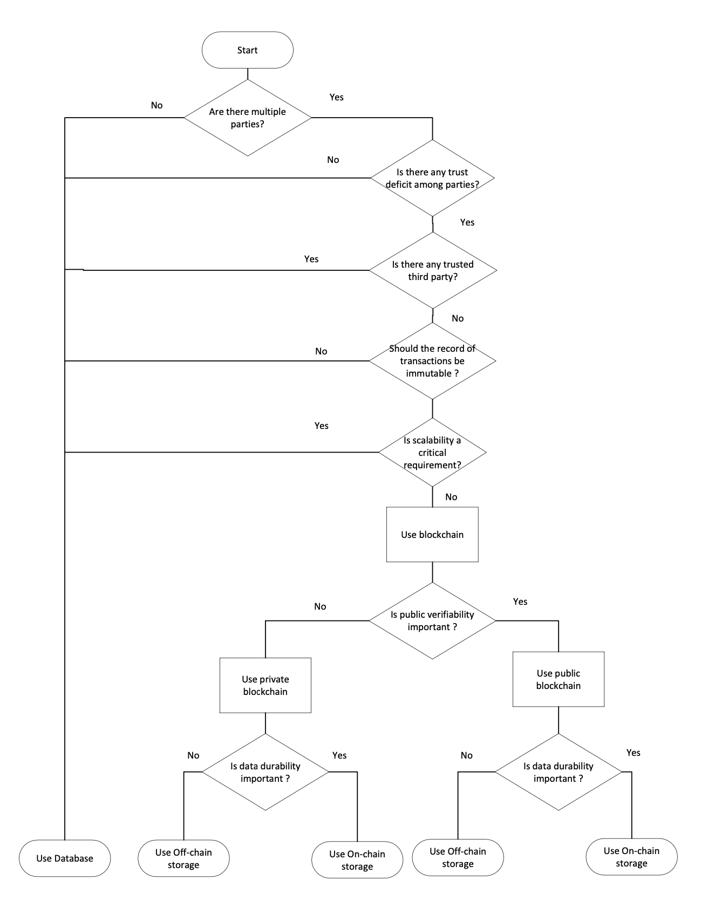
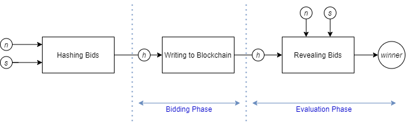
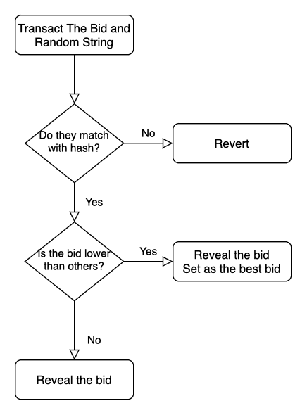
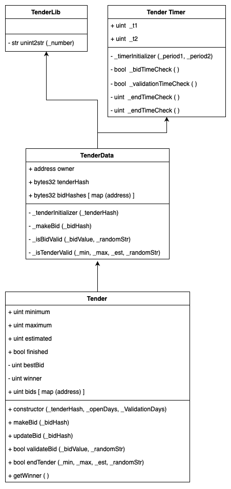
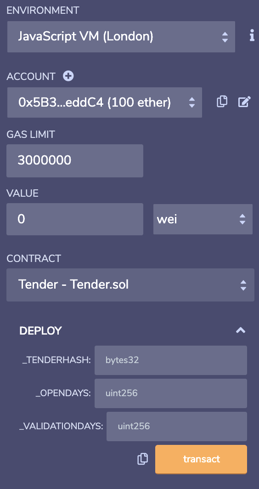
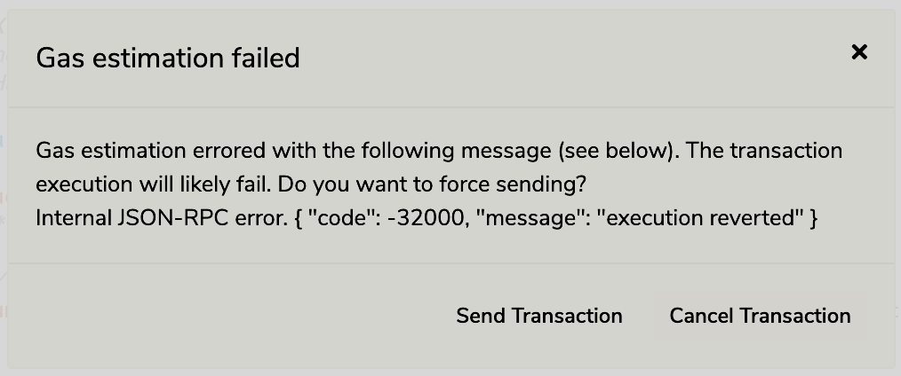

> **About this edition.** This is the digital edition of the graduation project report "Blockchain-based e-Tendering System". The original was submitted to Istanbul Technical University in August 2021; it is kept unchanged as [thesis.pdf](https://github.com/urtuba/open-tendering-in-ethereum/blob/main/thesis.pdf). This edition fixes language and formatting mistakes. The content, the numbers and the conclusions are the 2021 work. Where a 2021 statement is now outdated or technically wrong, a short **2026 note** follows it instead of a rewrite. The student number is left out. The list "Changes in this edition" at the end gives the details.
>
> The code of the project, the tests added in 2026 and the known limitations of the contracts are in the [GitHub repository](https://github.com/urtuba/open-tendering-in-ethereum).

**Istanbul Technical University**<br>
Faculty of Computer and Informatics Engineering<br>
Department: Computer Engineering<br>
Division: Computer Engineering

**Blockchain-based e-Tendering System**<br>
Graduation Project Final Report

**Samed Kahyaoğlu**

Advisor: Asst. Prof. Dr. Mehmet Tahir Sandıkkaya<br>
August 2021

**Contents**

* TOC
{:toc}

## Statement of Authenticity

I hereby declare that in this study

1. all content influenced by external references is cited clearly and in detail,
2. and all the remaining sections, especially the theoretical studies and the implemented software/hardware that constitute the fundamental essence of this study, originate from my own individual work.

İstanbul, August 2021

Samed Kahyaoğlu

## Acknowledgments

I would like to thank my teacher Mehmet Tahir Sandıkkaya, who helped me a lot in this study, and my family, who supported me throughout my education.

## Summary

**Blockchain-based e-Tendering System**

States generally purchase public services and products through tenders. Tenders prioritize efficiency in public expenditure and equal economic opportunity. They were designed to spend taxpayers' money properly and efficiently, but in many countries they have become a tool for corruption. Blockchain can reduce corruption problems in auctions through openness and inclusiveness. This project aims to implement the tender procedure as a smart contract.

The Blockchain-based e-Tender System aims to perform the basic functions of a tender in a smart contract. The behaviour of this contract changes over time. The definition of a tender is derived from the definition of the open tender procedure in the Turkish Public Procurement Law. According to this definition, the tender commission determines an estimated value for a tender, and a minimum and a maximum amount are determined based on the estimated value. If the tender is not concluded between the minimum and the maximum, the tender commission reviews the situation. In the ideal scenario, the best (lowest) bid is within these limits. The project eliminates human intervention in bidding and in determining the winner in the ideal scenario. In the open tender procedure, the minimum and maximum values are kept confidential until the end of the tender, and the bids of the participants are also kept confidential. But once the tender is complete, this data becomes publicly accessible for transparency and trust.

The project uses Ethereum and the programming language Solidity to develop smart contracts. Ethereum is an open blockchain, but people can also run their own private Ethereum blockchains. In this project, the public Ethereum network or a similar public blockchain that is compatible with the Ethereum Virtual Machine is considered the ecosystem. While major security concerns are delegated to a public network that is theoretically secure, trust and transparency are protected. People can use their own tools or trusted web3 applications that the community has developed to interact with smart contracts.

A fundamental problem with using an Ethereum network is that all data on the network is accessible to everyone. To ensure confidentiality between bids, the life cycle of the tender contract is divided into three separate phases: bidding, evaluation and post-tendering. When creating the tender, the tender organizer uses a hash of data containing the minimum, maximum and estimated values, and the phase lengths of the tender. In the bidding phase, users send the hash value of their bid combined with a random character string to the smart contract, instead of their actual bid. During the evaluation phase, users verify their bids against these hash values, and the most appropriate bid is calculated. In the post-tendering phase, the tender organizer reveals the hidden limits of the tender, and if the owner of the most suitable bid has submitted a bid that meets the limits, the winner is determined. The data of the smart contract and the contract itself never change after the tender is finished by the organizer.

Within the scope of the project, a simple Python program was written as a precaution against the problems that users may experience in creating hash values. With this program, it is possible to create hash values as a tender organizer or as a bidder. The program will also help programmers as a draft that can be developed to be more secure. Since the hash values created with this Python code are created by the same method as the standard Keccak hash function calculated by Solidity, there is no problem in verifying them afterwards. With this helper, anyone can start using the tendering smart contracts immediately.

The smart contracts were developed using Ethereum Remix and deployed to Ethereum networks such as Ethereum Ropsten and BSC Testnet via Remix and wallets created with MetaMask. While testing, various usage scenarios covering all functions and failures were used. The common writing style of the Ethereum developer community is used, and all source code is available on [GitHub](https://github.com/urtuba/open-tendering-in-ethereum).

> **2026 note:** The Ropsten test network was shut down in 2022. See also the note in section 6.1.

## Özet

**Blokzincir Tabanlı e-İhale Sistemi**

Devletler kamu hizmet ve ürün alımlarını genellikle ihaleler üzerinden yaparlar. İhaleler, kamu harcamalarında verimliliği ve ekonomik fırsat eşitliğini sağlamayı önceler. Toplanan vergilerin doğru ve verimli şekilde harcanması için dizayn edilmişlerdir ama birçok ülkede yolsuzluk için bir araç haline gelmişlerdir. Blockchain, ihalelerdeki bu problemlerin bazılarını açıklık ve kapsayıcılık ile elimine edebilir. Bu proje, ihale prosedürünü bir akıllı kontrat olarak gerçekleştirmeyi amaçlar.

Blokzincir Tabanlı e-İhale Sistemi bir ihalenin temel işlevlerini akıllı sözleşme üzerinde gerçeklemeyi amaçlar. İşbu sözleşmenin davranışı, zaman içerisinde değişim gösterir. İhale tanımı olarak Türk Kamu İhale Kanunu'nun açık ihale usulü tanımı baz alınmıştır. Bu tanıma göre ihale komisyonu bir tahmini ücret belirler ve bu ücrete göre bir minimum ve maksimum rakam belirlenir. İhalenin minimum ile maksimum arasında sonuçlanmaması halinde ihale komisyonu toplanır ve durumu gözden geçirerek karar verir. İdeal senaryoda en iyi (en düşük) teklif bu sınırlar içerisindedir. Proje, ideal senaryo içerisinde teklif verme, kazanan belirleme konularında insan müdahalesini ortadan kaldırır. Açık ihale usulünde minimum ve maksimum değerler ihale bitene kadar gizli tutulur, katılımcıların teklifleri de aynı şekilde gizli tutulur. Ama ihale tamamlandığında şeffaflık ve güven oluşması için bu veriler kamuya açık hale gelir.

Akıllı kontratlar Ethereum Sanal Makinesi'nde çalıştırılmak üzere Solidity dili ile yazılmıştır. Proje ihalenin genel matematiksel ve mantık işlemlerini kapsamayı amaçlar. Ancak ihalelerde bulunan kimi prosedürler diğer kamu kurumları ya da hizmetleriyle bağlantılı olabilir. Bu yüzden sistemin daha entegre ve verimli hale getirilebilmesi, diğer kamu hizmetlerinin de blokzincir ekosistemine taşınması ile sağlanabilir. Proje özelinde ekosistem olarak Ethereum veya Ethereum Sanal Makinesi uyumlu bir açık blokzincir ağı baz alınır. Bu sayede blokzincirdeki verinin güvenliği sağlanırken şeffaflık ve kamu güveni artırılır. Tüm işlemler geriye dönük olarak merkezsiz blokzincirine kaydedilir. Kullanıcılar kendi programları ya da topluluk tarafından geliştirilen güvenli uygulamalar yoluyla akıllı sözleşmelerle etkileşime geçebilir.

Ethereum ağı kullanmanın temel bir sorunu, ağdaki tüm verilerin herkes için erişilebilir olmasıdır. Teklifler arası gizliliğin sağlanması için ihale sözleşmesinin yaşam döngüsü üç ayrı aşamada belirlenmiştir: teklif toplama, hesaplama ve ihale sonrası. İhale organizatörü ihaleyi yaratırken en az, en fazla ve tahmin edilen değerleri içeren bir verinin karmasını ve ihalenin aşama uzunluklarını kullanır. Teklif toplama aşamasında kullanıcılar gerçek teklifleri yerine, teklif ve rastgele bir karakter dizisinin karma değerini akıllı sözleşmeye iletirler. Hesaplama aşamasında kullanıcılar bu karma değerine karşılık gelen tekliflerini doğrularlar ve en uygun teklif hesaplanır. İhale sonrası aşamada ise ihale organizatörü ihalenin gizli sınırlamalarını doğrular; eğer en uygun teklifin sahibi sınırlara uygun bir teklif vermişse kazanan olarak belirlenir. İhale organizatör tarafından bitirildikten sonra akıllı sözleşme ve sözleşmenin verisi asla değişmez.

Kullanıcıların hatalı işlemleri doğru sanmaları ya da yanlış zamanda yaptıkları geçersiz işlemler sebebiyle maddi kayıp yaşamamaları amacıyla fonksiyonlarda sadece doğru gerçekleşmeleri için uygun durumlar göz önünde bulundurulmuştur. Süre geçtikten sonra teklif vermek gibi bir yanlış etkileşim halinde akıllı sözleşme hata belirten bir mesaj dönmek yerine o fonksiyonu geri döndürür. Yapılmış tüm işlemler geçersiz sayılır ve sözleşme durumu korunur. Kullanıcılar da geri döndürülecek fonksiyonları önceden bildiren IDE'ler sayesinde gerçekleşmeyecek bir işlem için ücret ödemekten kurtulabilirler. Ancak ne sebeple işlemlerinin gerçekleşmediğini anlamak için ihale süreci hakkında bilgilendirilmeleri gerekir.

Proje kapsamında kullanıcıların karma değeri oluşturma konusunda yaşayabilecekleri sorunlara önlem olarak basit bir Python programı yazılmıştır. Bu program komut satırından çağrıldığında, ihale organizatörü ya da teklif veren olarak karma değeri oluşturmak mümkün olur. Program, daha güvenli olması yönünde geliştirilebilecek bir taslak olarak da programcılara yardımcı olacaktır. Bu Python kodu ile oluşturulan karma değerler, Solidity tarafından standart olarak hesaplanan Keccak özet alma fonksiyonuyla aynı yöntemle oluşturulduğu için sonradan doğrulanması problem yaratmaz. Bu yardımcı dosya ile birlikte akıllı sözleşmeleri herhangi bir insanın hemen kullanmaya başlaması mümkündür.

İlgili akıllı sözleşmeler Ethereum Remix kullanılarak geliştirilmiş, Metamask ile oluşturulan cüzdanlar aracılığıyla Remix üzerinden Ethereum Ropsten, BSC Testnet gibi Ethereum ağlarına yüklenmiş ve transfer edilmiştir. Test edilirken toplamda tüm fonksiyonları ve hataları kapsayan kullanım senaryoları kullanılmıştır. Ethereum geliştirici topluluğunun yaygın yazım stili kullanılmıştır ve tüm kaynak kodlar [GitHub](https://github.com/urtuba/open-tendering-in-ethereum) üzerinde açık haldedir.

## List of Abbreviations

| Abbreviation | Meaning |
|---|---|
| DBMS | Database management system |
| DSP | Double-spending problem |
| DLT | Distributed ledger technology |
| TPPL | Turkish Public Procurement Law |
| OPT | Open procedure tender |
| EVM | Ethereum Virtual Machine |
| EOA | Externally owned account |
| OOP | Object-oriented programming |
| SHA | Secure hash algorithms |
| NIST | National Institute of Standards and Technology |
| BSC | Binance Smart Chain |

## 1. Introduction and Project Summary

Public procurement is a public trust problem about how taxes are spent. Countries use tenders to achieve trust and efficiency in government expenditure. However, corruption is a universal problem and exists in many countries [[2]](#ref-2). Blockchain technology is claimed to solve trust problems that require trusted intermediaries. In this project, the open procedure of the Turkish Public Procurement Law is implemented using blockchain. Ethereum and its programming language Solidity are used to code the smart contracts. The implementation covers the standard procedure. Exceptional cases are not solved. Thus, decisions taken by humans are not eliminated completely, but reduced.

### 1.1 Background

A database is the generic name for any data collection. In information technologies, database management systems (DBMS) are used to store data in a structured way. In the financial industry and in public affairs, people's records are stored in a central database using a DBMS. A DBMS has database administrators and other authorized users who can manipulate data. People who are authorized to insert, update or delete critical data are a potential point of failure. People can make mistakes or abuse their authority. A DBMS always needs trusted intermediaries to keep data correct and up to date. This problem was solved with Bitcoin, using a distributed ledger technology named blockchain. As human intervention is no longer necessary, blockchain technology is a new paradigm in how data is managed. In blockchain, trusting math replaces trusting people [[3]](#ref-3).

Digital assets are easily copied, unlike physical assets. Therefore, once digital money is created, it can be spent multiple times. The problem of spending the same money more than once is called the double-spending problem (DSP). In the monetary system, the DSP is always managed by financial institutions. People trust banks, and banks trust authorized personnel. People cannot claim ownership of any digital asset without referencing a trusted third party. When Bitcoin and the underlying blockchain technology were first conceptualized in 2008, the double-spending problem had a solution without any trusted intermediary [[4]](#ref-4). Bitcoin is an electronic cash system that is free of the possible weaknesses of a trusted third party [[4]](#ref-4). Blockchain is a distributed database system that has pseudonymous privacy, security, inclusivity and immutability in its nature; it is a database whose correctness is approved by the consensus of its participants. It is used to ensure the correctness of transaction records in electronic cash systems called cryptocurrencies.

### 1.2 Motivation

Considering blockchain as a distributed database technology instead of only an e-cash transfer protocol led to further fields of application. Blockchain has changed the perspective on problems in many industries, including government and public services. Smart contracts on blockchains such as Ethereum provide different solutions to conventional trust problems. Ethereum combines DLT with a computer named the Ethereum Virtual Machine, which relies on distributed computing [[5]](#ref-5). Ethereum is a platform to develop distributed applications that are controlled by contracts. These contracts are immutable, and they can replace some solutions to real-world problems that until now had to be solved by trusted intermediaries. A study comparing blockchain and classical databases created a decision tree that shows for which problems the use of blockchain is appropriate [[1]](#ref-1).



*Figure 1.1: Decision tree to determine the use of blockchain [[1]](#ref-1)*

The tender process has multiple stakeholders: applicants, government and taxpayers. The trust between these parties is important for the efficiency of public expenditure, equal economic opportunity and public trust. To ensure these values, government agencies and officials are involved as trusted third parties. Each tender has its own application scale, which can be considered small data that must be verified by the public. This data must be open to retrospective investigation. When all these features are evaluated together with the decision tree in Figure 1.1, the public tendering process is a good fit for a blockchain solution.

### 1.3 Legal Basis

Different types of tenders are described in the Turkish Public Procurement Law. This paper and its solution have been prepared specifically for the open procedure (*açık ihale usulü*); a tender with the open procedure is called an open procedure tender (OPT) in this paper. An OPT allows any participant who satisfies the requirements to join. The commission determines the estimated price and decides the upper and lower limits for bids. The estimated price and the limits are not shared with the public until the decision day. Bidders submit their bids within the given period and deposit a specified amount of money as a guarantee. The best price is accepted unless there are legal concerns or exceptions. Some exceptions may affect decisions, such as the best price being below the lower limit or above the upper limit [[6]](#ref-6). The ideal scenario (excluding exceptions) for OPTs is this paper's area of interest. However, there are different cases or parts of an OPT that are not deterministic enough to be implemented in the EVM yet.

> **2026 note:** This section describes the law as it was in 2021. The law may have been amended since. Check the current text before relying on it.

## 2. Technical Background

### 2.1 Ethereum

Ethereum is a cryptocurrency-backed, open-source blockchain that allows the development of blockchain applications. It is used to develop games, decentralized exchanges, tokens and various other decentralized applications. Ethereum has a native currency named ether, which is used to incentivize good behaviour and to pay for EVM processing power. Transactions simply transfer ether, but they can have an additional data field. This data field has bytecode to be run by the EVM [[5]](#ref-5). Each instruction in the EVM instruction set requires a certain number of gas units to be executed. The price of a unit of gas is called the gas price in Ethereum. Gas prices are determined in a free market. Each transaction has a "gas price" field specifying the sender's offer and a "start gas" field for the maximum number of gas units to use. Miners execute the best offers for themselves [[7]](#ref-7). In Ethereum, blockchain interactions between accounts are done with transactions; thus each transaction has a sender account and a receiver account. Mined transactions are written in blocks. Each block updates the machine state: account balances and stored changes.


*Figure 2.1: Data payload of a transaction and data of a mined transaction*

> **2026 note:** Fees and transaction fields have changed since 2021. With the London upgrade (August 2021, EIP-1559) a transaction pays a base fee, which is burned, plus a priority tip, and it carries the fields `maxFeePerGas` and `maxPriorityFeePerGas` instead of a single gas price. Transactions now come in several typed formats. Since September 2022 Ethereum is secured by validators (proof of stake), not by miners.

Ethereum has two types of accounts: externally owned accounts and contract accounts. EOAs have an ether balance, are controlled by their owners with private keys, and have no code associated with them. Contract accounts have code, have no owner after deployment, and can interact with other contract accounts and EOAs when triggered by a message [[8]](#ref-8). An EOA can call functions in contract accounts, and they can return value responses [[5]](#ref-5). As an analogy, each EOA is a user, each contract account is a computer application, and the EVM is a distributed computer. The miner population guarantees security. Private keys and addresses provide confidentiality while allowing transparency.

> **2026 note:** Since the Pectra upgrade (2025, EIP-7702) an EOA can delegate to contract code, so "no code associated" is no longer always true. The tender contracts do not depend on this.

A fundamental advantage of Ethereum over previous blockchain networks is that the smart contracts running on it are aware of the blockchain network. The contract code can read block data and addresses. This allows Ethereum smart contracts to be coded to change behaviour over time. Block time can be used to predict and scope future events. By using block time, a smart contract can change the behaviour of its own functions. Since tendering has time constraints, block awareness is a must-have for blockchain-based tendering. The features mentioned above are Ethereum's advantages for developing such systems.

A public tender is a standardized process that runs in each procurement. It can be implemented as a smart contract. Since code on the EVM is aware of the blockchain itself, it can use the timestamps of blocks for time-dependent events, so we do not need to get the current time from an external source. The starting and ending times of tenders can be represented in the blockchain. The ability of smart contracts to communicate with each other helps us to separate the general tendering process from the instances of the process. Each tender may have a different address by using proxy contracts, which delegate execution to the implementation contract. Thus, openness is more obvious, since all citizens may inquire about any tender with its own Ethereum address.

### 2.2 Solidity and Smart Contracts

Solidity is a smart contract language developed to run on the EVM. Solidity is an object-oriented programming language; contracts are similar to classes in other OOP languages. Polymorphism and libraries are supported, as well as user-defined data types. Solidity is statically typed and Turing-complete [[9]](#ref-9). It is the most used smart contract language. Solidity has Ethereum-specific methods to interact with the blockchain. Since the Ethereum blockchain is open, any smart contract code or function call can be observed by anyone. Therefore, security practices for Solidity code may differ from those for general-purpose programming languages.

Writing data into the Ethereum blockchain is costly, therefore smart contracts are designed to be simple, less data-dependent programs. Large blocks of code are not preferred in smart contracts. A smart contract is identified by a contract address after it is created; it has its own storage, executable code and ether balance. Contract code is low-level bytecode called EVM code. High-level Solidity code is compiled into EVM code [[10]](#ref-10). A contract has some functions that have to be triggered by transactions to the contract address. Executed contract code changes the chain state immutably; therefore state changes are not recorded to the blockchain until the code has run and finished successfully. If a function call has a problem during execution, all previous operations are reverted, even though the transaction is recorded in the blockchain.

Solidity code is compiled using the relevant version of the Solidity compiler. Compiled code is deployed using third-party applications such as Ethereum Remix, or web3 libraries in programming languages. The Ethereum network has a JSON-RPC endpoint to interact with, thus any user can interact with the blockchain without running a node. Smart contracts may refer to other smart contracts using their contract addresses. Therefore, functions of previously created smart contracts can be used by newer ones for cost-efficient deployments.

## 3. Comparative Literature Survey

Governmental expenditures are made through tenders, using citizens' taxes. Public tendering must be transparent to build trust in governance. Blockchain is also claimed to be transparent, and many blockchain projects are developed for transparent governance. Some tendering solutions using blockchain have been proposed and developed before. They are generally not about implementing existing rules but about creating a transparent-governance utopia. A procedure designed for the TPPL was not implemented before; however, there are similar solutions.

Tendering is one of the possible fields that blockchain may change in the future. However, there was no specific study, design or implementation about tendering in blockchain before 2018. One of the first studies on the topic [[11]](#ref-11) appeared in 2018. Its implementation is done with Solidity smart contracts, as in this project, but the system was a tendering framework rather than the realization of a specific law. This year can be assumed to be the starting point of the discussion about tendering in Ethereum and blockchain.

In the following years, some implementations were proposed and implemented for tendering in the blockchain. Some of them prioritized open governance; others prioritized archiving or verification. A typical solution for tendering contracts is hashing bids, then sending the hashes to smart contracts. Then, bids are validated by trusted intermediaries using SHA-3 hashes recorded in the blockchain. However, some researchers implemented all steps of tendering, from bidding to declaring the winner, in the blockchain [[12]](#ref-12). This project aims to include all steps, in compliance with the Turkish Procurement Law. Some similar examples exist; however, the subject is new, and the implemented solutions are few and not localized. Thus, contributions to this topic could lead to more efficient and trustworthy tenders.

> **2026 note:** This survey reflects the state of research in 2021. It was not updated, and many works on blockchain-based tendering have appeared since.

## 4. Bypassing Ethereum's Limitations

Besides Ethereum's advantages and its fit for tendering, it has some limitations. Confidentiality of bids and tender constraints is a problem, since all data in the Ethereum blockchain is open to the public. This problem may be eliminated by hashing values; however, hashed data has its own problems. The proposed two-phase process eliminates the confidentiality problem successfully. An evaluation phase exists besides the well-known bidding phase of tenders. Problems and solutions are covered below.

### 4.1 Achieving Confidentiality

Confidentiality is one of the major principles in an open public tender; however, Ethereum is transparent. Anybody can look for any data in the blockchain. Functions, variables, arguments, and anything except private keys are accessible [[5]](#ref-5). Bidders reveal their addresses and bid prices if the offer is stored in the contract. A participant can inspect previous offers and determine the minimum (best) offer; therefore, offering any price above the best offer is obviously illogical. Therefore, bids have to be hidden before they are sent to the blockchain.

```text
f(n) = h            (1)

f(n || s) = h       (2)
```

The solution is a hash function (*f*) that maps integers (*n*) to a fixed-size byte string (*h*) that may hide the number (Equation 1). However, hashing without unexpected input does not provide security. Anybody can determine a reasonable price range for the tender and create hashes for every integer in the range to find any offer's price. When a commitment scheme is applied to the bid, hashing the combined input is safe. A character string version of the bid (*n*) is concatenated with a randomly generated string (*s*) to create a character string. This string is used as input to the hash function (Equation 2). The produced hashes are secure if the hashing algorithm is secure. In this case, the Keccak algorithm is used, since it is natively supported by Solidity. Participants of the tender clarify their bids after the bidding phase by using the bid values and the randomly generated strings. The procedure described above is visualized in Figure 4.1.

A similar commitment method is applied to the tender constraint values that have to be kept secret during the tendering process. The minimum, maximum and estimated values are concatenated with a randomly generated string to produce the input string. The hash of the input is stored as the tender hash. Tender organizers reveal the tender constraints after the bidding and evaluation phases. The winner of the evaluation phase is declared the winner if the bid satisfies the conditions.



*Figure 4.1: Model of the bidding procedure*

### 4.2 Comparison Problem

Comparison operations are required to list bids in order to declare the winner. However, Ethereum has limitations in code execution. Each execution has to be triggered by a function call to a contract. Automated programs are not possible in the Ethereum Virtual Machine. The solution is to execute comparison operations when function calls are made. Another limitation is storing hash values; they are irreversible. Comparing two bids using their hash values is impossible. Thus, arithmetic and logic operations are executed while bids are being revealed. These operations are all done in the evaluation phase.



*Figure 4.2: Revealing bid transaction*

Each bid should be revealed in the evaluation phase to be valid. Bidders provide the initial bid value and the pseudo-random string. If the Keccak-256 hash of the revealing transaction matches one of the bid transactions, the original bid value is stored alongside the hash value. This transaction also triggers a piece of code that compares the previous best bid with the revealed bid. If the last transaction reveals a value that is lower than the previous best bid, it is recorded as the best bid instead of the previously stored value. When the evaluation phase ends, the revealed bids are considered valid, and the winner and the winner's bid are already calculated.

## 5. Design and Implementation

### 5.1 Environment

To create and interact with smart contracts, we need externally owned accounts. MetaMask, a Google Chrome extension, is used to create and manage EOAs. MetaMask can interact with web3 applications like Ethereum Remix and Etherscan. Ethereum test networks are used for the blockchain. MetaMask can be used with any Ethereum network.

Solidity code is written in a text editor, compiled and deployed to the blockchain. The Ethereum Foundation has an online integrated development environment called Ethereum Remix. All development, debugging and deployment operations are supported by Remix. Remix also runs a JavaScript EVM for testing contracts locally. Remix can compile the code with any compiler version. Solidity versions from 0.4.0 up to, but not including, 0.6.0 are used in the project. All smart contract development is done using Remix.

> **2026 note:** The contracts are written for Solidity 0.4.x and 0.5.x and compiled with 0.5.17. They are not ported. Current Solidity (0.8.x) checks arithmetic overflow by default, and `now`, which the contracts use, was deprecated in 0.7 in favour of `block.timestamp`.

Some programming languages have libraries to develop web3 applications. The Web3.py interface [[13]](#ref-13) in Python is used to create hash values in a way that can be reproduced in the EVM. Web3.py is not used to interact with the Ethereum blockchain.

### 5.2 Design and Implementation

The application is designed with the OOP approach. Variables and utilities with similar purposes are implemented together in different contracts. Inheritance is used to simplify the code. Each contract has its own file. The contract files are all compiled together when the inheriting Tender contract is compiled. TenderLib contains the function needed to convert an integer to a string. The TenderTimer contract keeps track of time for the tender. TenderData holds the hashed versions of bids and defines internal functionality to simplify the tender implementation.

The following interactions are defined in the Tender contract: make a bid (`makeBid`), update a bid (`updateBid`), validate your bid after bidding ends (`validateBid`), end the tender if the procedure is done (`endTender`) and a method to get the winner (`getWinner`). All the data about the tendering process is publicly reachable. Compilers automatically create getter methods for public variables. The Tender contract is the user interface for the tender, bringing the functionality of the inherited contracts together. Figure 5.1 shows the inheritance schema; a plus sign refers to public members, while a minus sign stands for private or internal members.



*Figure 5.1: Inheritance of contracts*

> **2026 note:** The diagram differs from the code in four small points. The timer variables are named `t1` and `t2`, without an underscore. `_endTimeCheck` appears once, not twice, and returns `bool`. `winner` has the type `address`, not `uint`. `getWinner` returns an `address`.

#### 5.2.1 Contract Deployment

While deploying the Tender contract using Remix, the constructor parameters are given. While `openDays` specifies the length of the bidding phase, `validationDays` specifies the length of the evaluation phase. The constructor calls the initializers of TenderData and TenderTimer. TenderTimer determines two time points when the contract is created. `t1` is the time when the bidding phase ends and the validation phase starts. `t2` is the time when validation ends. The tender timer module is used to check whether transactions are not allowed in the current phase. The account address that is the message sender of the contract creation call is recorded as the tender owner. The owner does not have permission to make a bid for their own tender. When the owner deploys the contract, the tendering process begins. The contract has a life span consisting of three phases: the bidding phase, the evaluation phase and the post-tendering phase.



*Figure 5.2: Deployment interface for the compiled Tender.sol*

#### 5.2.2 Bidding Phase

Applicants of the tender do not send their actual bids, to achieve confidentiality. They have to create a hash code using the algorithm given below. The bid hash value is calculated using the Web3.py Keccak function, with a parameter that concatenates the bid and a random padding string. A similar process was also used in the creation of the tender hash. These procedures are implemented to help applicants create hash values.

> **2026 note:** The helper `create_hash.py` called `Web3.solidityKeccak`, which was renamed `Web3.solidity_keccak` in web3.py 6. The helper was fixed in 2026 and now works with web3.py 8, and a test checks that its hashes are accepted by the contract.

```text
Algorithm 1: create hash for a bid
str bid ← INPUT
str secureLength ← 32
str randomStr ← randomString(secureLength - length(bid))
str bidStr ← concat(bid, randomStr)
str hashStr ← Keccak(bidStr)
bytes32 hash ← toHex(hashStr)
```

While the current time is less than `t1`, the contract is in the bidding phase. Applicants make bids without revealing their offers. Making and updating bids are separate because they are different procedures in reality; separating them also makes the retrospective data readable. Both delegate the update operation to the internal `_makeBid` function. After `t1`, all requests to make or update bids are reverted.

```text
Algorithm 2: makeBid (_bidHash)
if bidHash[sender] is undefined then
    if now < t1 then
        bytes32 bidHash[sender] ← _bidHash
    end
end
```

```text
Algorithm 3: updateBid (_bidHash)
if bidHash[sender] is defined then
    if now < t1 then
        bytes32 bidHash[sender] ← _bidHash
    end
end
```

#### 5.2.3 Evaluation Phase

Since all bids are recorded with corresponding hash values, bids are revealed to end the tender. As mentioned in section 4.2, hash values cannot be compared to each other to sort bids. Bids should be stored as numbers for openness and to sort them. Applicants call the bid validation function with their bid values as numbers and the random padding strings. Each successfully validated bid is recorded in a mapping from public address to integer. If the applicant's bid is lower than the previous best bid, the best bid and the address of the winner are updated with the applicant's data. All validation calls outside the interval *t1 < t < t2*, called the evaluation phase, are reverted.

```text
Algorithm 4: validateBid (_bidValue, _randomStr)
if bidHash[msg.sender] is defined then
    if t1 < now and now < t2 then
        str bidStr ← uint2str(_bidValue)
        bytes hash ← concat(bidStr, _randomStr)

        if bidHash[msg.sender] = hash then
            int bids[msg.sender] ← _bidValue

            if bidValue < bestBid then
                bestBid ← _bidValue
                winner ← msg.sender
            end
            RETURN (true)
        end
    end
end
```

> **2026 note:** The pseudo-code leaves out one step. The contract compares the stored bid hash with the Keccak-256 hash of the concatenated text, not with the text itself.

#### 5.2.4 Post-Tendering Phase

After the end of the evaluation phase, all function calls that change the contract state are disallowed. The owner of the tender contract reveals the tender details after `t2`. If the revealed constraints are satisfied by the winner, the `getWinner` function returns the address of the winner to all callers. If the winner's bid is out of bounds of the minimum or maximum, `getWinner` reverts the transaction instead of returning an address. Once the owner ends the tender, the contract storage and phase never change.

> **2026 note:** The tests added in 2026 show that this is not fully true. `endTender` can be called again after the tender has ended. Because of how the tender hash is built (see the note in section 6.3), the owner can then reveal a different maximum value. See the [known limitations](https://github.com/urtuba/open-tendering-in-ethereum#known-limitations).

## 6. Comparative Evaluation and Discussion

### 6.1 Testing Functions

The contract code is designed to respond to function calls only when they are allowed. There are time and address constraints. For example, the owner cannot submit new bids, and no bid can be submitted after the bidding phase. All of these rules are implemented as requirements or if statements that prevent the code from reaching the return statement. All function calls except those satisfying the constraints are reverted. Thus, no operation can modify contract data and end successfully, except valid function calls. There are three types of constraints: time, address (account) and dependent functions. The `updateBid` function can be used only if `makeBid` was used before, and `getWinner` returns a result only after `endTender`.

**Table 6.1: Time constraints for functions**

| | Bidding phase | Evaluation phase | Post-tendering phase |
|---|---|---|---|
| makeBid | pass | revert | revert |
| updateBid | pass | revert | revert |
| validateBid | revert | pass | revert |
| endTender | revert | revert | pass |
| getWinner | revert | revert | pass |

**Table 6.2: Address constraints for functions**

| | Owner | Applicant |
|---|---|---|
| makeBid | revert | pass |
| updateBid | revert | pass |
| validateBid | revert | pass |
| endTender | pass | revert |
| getWinner | pass | pass |

Solidity code is compiled for the EVM. The tendering contract can be deployed to any EVM-compatible network. The contract was created and tested on Remix's JavaScript EVM, the Ethereum Ropsten testnet and the Binance Smart Chain testnet. A testnet is a free-to-use blockchain network with lower difficulty for building blocks. Final tests were run on the BSC testnet, since the BSC testnet is EVM-compatible [[14]](#ref-14) and has a useful block explorer. For testing purposes, days are replaced with minutes and hours. After successful tests, tests covering all cases were done using the deployed, verified contract on the BSC testnet, with 1 hour of bidding and 1 hour of evaluation phase.

> **2026 note:** The Ropsten testnet was shut down in 2022. Binance Smart Chain was renamed BNB Smart Chain in 2022. The tests described here were run by hand in 2021 and cannot be repeated on Ropsten.
>
> **2026 note:** In 2026 automated tests were added to the repository. They run the same cases (and more) against the unchanged contracts on a local Hardhat network, and they run in CI on every change.

Since `getWinner` is a view function, it does not need to spend gas to be called, and it cannot modify the contract data. Tests are applied to the first four functions in Table 6.2, since they may modify contract storage. The final test that covers all constraints for these four functions was done with four accounts. The accounts were created by MetaMask, and the transactions were created using Ethereum Remix connected to MetaMask. The contract was tested with function calls against the constraints in different execution scenarios covering each situation. Table 6.3 shows the results of an example scenario. The deployed contract address and the transaction history of the example in the table can be reached in the BSC testnet block explorer, with detailed results on [GitHub](https://github.com/urtuba/open-tendering-in-ethereum).

**Table 6.3: An example scenario and test results**

| Order | Account | Phase | Operation | Result |
|---|---|---|---|---|
| 1 | A | Bidding | constructor | Success |
| 2 | A | Bidding | makeBid (Revert: disabled for owner) | Reverted |
| 3 | B | Bidding | makeBid | Success |
| 4 | C | Bidding | updateBid (Revert: makeBid required) | Reverted |
| 5 | C | Bidding | makeBid | Success |
| 6 | C | Bidding | updateBid | Success |
| 7 | A | Bidding | endTender (Revert: not in post-tendering phase) | Reverted |
| 8 | B | Bidding | validateBid (Revert: not in evaluation phase) | Reverted |
| 9 | D | Evaluation | validateBid (Revert: makeBid required) | Reverted |
| 10 | B | Evaluation | validateBid | Success |
| 11 | D | Evaluation | makeBid (Revert: not in bidding phase) | Reverted |
| 12 | C | Evaluation | validateBid (Revert: invalid input) | Reverted |
| 13 | C | Evaluation | validateBid | Success |
| 14 | A | Evaluation | endTender (Revert: not in post-tendering phase) | Reverted |
| 15 | A | Post-tendering | endTender (Revert: ownership required) | Reverted |
| 16 | A | Post-tendering | endTender | Success |

All functions were called using Ethereum Remix with injected Web3. Ethereum Remix warned against all failed transactions before submitting them. Interacting with contracts using trusted third-party tools is easier, and warnings prevent users from sending disallowed function calls. Using warnings before sending a transaction saves the gas money that would be spent on a reverted function. It is more user-friendly and secure than returning false.

### 6.2 Coverage

The outcome of this project is Solidity code consisting of four contracts and a Python script that shows how the hashes are created. The tender contracts are deployed to the EVM to run. The contract has three different states, called phases. The bidding phase is for applicants to make bids. In the second phase, called evaluation, bidders reveal their actual bids by providing the inputs of their committed hash values. Bid updates are not allowed in this state. The best bid is calculated during the evaluation phase. The final state is the post-tendering phase. Applicants cannot perform any operations, and the tender owner (organizer) reveals the constraints as defined in the TPPL. If the best bid is within the boundaries, the owner of the bid is declared the winner. The tender is considered finished after the owner calls the `endTender` function. When the tender is finished, the `getWinner` function starts to return the winner, if one exists. This implementation covers the mathematical and logical rules of an OPT.

The aim of the project is to solve tendering, especially OPT, with smart contracts. In the implemented system, the mathematical background of tendering is covered. However, tenders have other constraints, such as application documents, fees, specifications etc. So the tendering contract must be supported by conventional methods in order to run. Agencies may announce specifications and the contract address related to the tender. Also, there is no ether transfer functionality in the contract. The tender contract is not capable of collecting fees or payments from applicants. Ether is not a replacement for conventional currencies. Winners may register with an official document, to comply with the classic procurement procedure, by proving ownership of the EOA that is the winner.

### 6.3 Confidentiality and Security

Bids are hashed with a randomly generated string to achieve confidentiality, and bids are not revealed before the evaluation phase. The implemented Python script proposes strings of length 64 for hashing tender data. This string is concatenated from the minimum, maximum and estimated values and a pseudo-random string. Bids are proposed to be hashed from strings of length 32, concatenated from a bid and a random string. An attacker trying to predict the price of bids while trying to find the random string is unlikely to succeed, since a random string of any length can be used.

The method used to secure bids is a simple commitment scheme. Commitment schemes are used to commit to values while keeping them hidden, in order to reveal them later [[15]](#ref-15). In the commitment scheme used in the tendering contracts, the bids are hidden to be revealed later. Since the EVM has a built-in Keccak hash function to create SHA-3 hashes, the Keccak function of Ethereum's web3.py is used. It is a secure hashing algorithm that won the NIST SHA-3 competition [[16]](#ref-16). An applicant commits to a hash of the bid extended by a pseudo-random string. The requested lengths of 32 and 64 are examples to show how the Python scripts create hashes. Applicants can select pseudo-random strings of arbitrary length to use the full potential of SHA-3.

> **2026 note:** The Keccak-256 function of Ethereum is not the same as the standardized SHA3-256 (NIST FIPS 202). The two use different padding and give different hashes for the same input. Keccak won the competition, but Ethereum uses the original version, not the final standard.
>
> **2026 note:** The scheme is weaker than described. The contract hashes the bid and the random string joined without a separator, and the tender hash ends with the maximum value followed by the random string. Digits can therefore be moved between the number and the random string: a bidder can reveal a lower or higher value than the one committed, and the organizer can reveal a different maximum. Also, the hash is not tied to the sender, so another address can copy a hash and reveal it with the same value and secret. The 2026 tests show each case; see the [known limitations](https://github.com/urtuba/open-tendering-in-ethereum#known-limitations). The contracts were not changed.

The security of the data is provided by the community of Ethereum or of the compatible blockchain where the contract is deployed. Attackers are not able to change the contract data, assuming Ethereum is secured by a consensus protocol such as proof of work. The only way to change contract data is to create the Ethereum blockchain faster than the trustworthy miners. Ethereum incentivizes trustworthy miners to prevent a 51% attack.

> **2026 note:** Ethereum moved from proof of work to proof of stake in September 2022 (the Merge). There are no miners any more; validators secure the network. The argument about security here refers to the proof-of-work model of 2021.

## 7. Conclusion and Future Work

### 7.1 The Project

The tendering smart contract for the OPT was developed in this study. Since tendering is a legal procedure, the laws were decisive for the design. The project covered the complete basics of tendering, such as making and updating bids and revealing results to the public. A violated condition reverts the function instead of returning false, so end users may be alerted by web3 applications before they pay the gas price for failed transactions.



*Figure 7.1: Remix warns that the transaction is going to fail*

Each tender is hosted at its own designated address in the blockchain. All interactions that change contract data and status are recorded. Retrospective investigations are easier than in any conventional system. The deployed source code is verified for openness. Any citizen can investigate the code and the historical transactions of any tender. It only provides the essential rules of tendering; it is a step towards open governance. Guidance for users is crucial, since society is not experienced enough with blockchain technology.

### 7.2 Future Work

There are points to improve in blockchain-based e-tendering. Tenders need documents and prerequisites that can be validated by blockchain. They may be part of this decentralized app. Attackers may also sabotage the contracts with very high or very low bids. Government agencies demand application fees depending on the size of the tender. This can be included in the contract: the `makeBid` function may demand an application fee in ether or in a token. The fee also makes attacking tenders illogical. Deploying the same contract for each tender may be inefficient and potentially a point of error. Proxy contracts may be used to refer to a valid implementation as a logic contract, while storing their own data. Using the address of the logic contract, everybody can be sure that the correct version of the contract is used.

The project's scope is narrow, but it points to a potential starting field for open governance. Some countries and communities are interested in blockchain-based open governance models, even using crypto assets as national currency. Using cryptocurrency as a national currency has its own risks and widespread macroeconomic effects to evaluate [[17]](#ref-17). However, smart contracts, such as the Blockchain-based e-Tendering System, are capable of working better when more governmental services use blockchain and crypto assets. Transitions to blockchain are likely to change existing laws on finance and governance.

## References

<a id="ref-1"></a>[1] M. J. M. Chowdhury, A. Colman, M. A. Kabir, J. Han, and P. Sarda, "Blockchain versus database: A critical analysis," in *2018 17th IEEE International Conference On Trust, Security And Privacy In Computing And Communications/12th IEEE International Conference On Big Data Science And Engineering (TrustCom/BigDataSE)*. IEEE, 2018, pp. 1348–1353.

<a id="ref-2"></a>[2] Y. Sezer, "Kamu ihale kanunu: Şeffaflık ve rekabet," *Amme İdaresi Dergisi*, vol. 35, no. 4, pp. 57–82, 2002.

<a id="ref-3"></a>[3] M. Nofer, P. Gomber, O. Hinz, and D. Schiereck, "Blockchain," *Business & Information Systems Engineering*, vol. 59, no. 3, pp. 183–187, 2017.

<a id="ref-4"></a>[4] S. Nakamoto, "Bitcoin: A peer-to-peer electronic cash system," *bitcoin.org*, 2008. [Online]. Available: <https://nakamotoinstitute.org/bitcoin/>

<a id="ref-5"></a>[5] V. Buterin, "A next-generation smart contract and decentralized application platform," *white paper*, vol. 3, no. 37, 2014. [Online]. Available: <https://cryptorating.eu/whitepapers/Ethereum/Ethereum_white_paper.pdf>

<a id="ref-6"></a>[6] "Kamu ihale kanunu (public procurement law)," *Resmi Gazete*, vol. 22.01.2002, no. 24648, 2002.

<a id="ref-7"></a>[7] R. Yang, T. Murray, P. Rimba, and U. Parampalli, "Empirically analyzing ethereum's gas mechanism," in *2019 IEEE European Symposium on Security and Privacy Workshops (EuroS&PW)*. IEEE, 2019, pp. 310–319.

<a id="ref-8"></a>[8] C. Dannen, *Introducing Ethereum and solidity*. Springer, 2017, vol. 318.

<a id="ref-9"></a>[9] M. Wohrer and U. Zdun, "Smart contracts: security patterns in the ethereum ecosystem and solidity," in *2018 International Workshop on Blockchain Oriented Software Engineering (IWBOSE)*. IEEE, 2018, pp. 2–8.

<a id="ref-10"></a>[10] L. Luu, D.-H. Chu, H. Olickel, P. Saxena, and A. Hobor, "Making smart contracts smarter," in *Proceedings of the 2016 ACM SIGSAC conference on computer and communications security*, 2016, pp. 254–269.

<a id="ref-11"></a>[11] F. S. Hardwick, R. N. Akram, and K. Markantonakis, "Fair and transparent blockchain based tendering framework - a step towards open governance," pp. 1342–1347, 2018.

<a id="ref-12"></a>[12] D. Mali, D. Mogaveera, P. Kitawat, and M. Jawwad, "Blockchain-based e-tendering system," pp. 357–362, 2020.

<a id="ref-13"></a>[13] E. Foundation, "Web3.py," <https://github.com/ethereum/web3.py>, 2021.

<a id="ref-14"></a>[14] B. C. Community. Binance chain documentation. [Online]. Available: <http://web.archive.org/web/20210813193411/https://docs.binance.org/>

<a id="ref-15"></a>[15] O. Goldreich, *Foundations of cryptography: volume 1, basic tools*. Cambridge university press, 2007.

<a id="ref-16"></a>[16] G. Bertoni, J. Daemen, M. Peeters, and G. Van Assche, "The making of keccak," *Cryptologia*, vol. 38, no. 1, pp. 26–60, 2014.

<a id="ref-17"></a>[17] T. Limba, A. Stankevičius, and A. Andrulevičius, "Towards sustainable cryptocurrency: Risk mitigations from a perspective of national security," 2019.

## Changes in this edition

This edition differs from the submitted PDF ([thesis.pdf](https://github.com/urtuba/open-tendering-in-ethereum/blob/main/thesis.pdf)) in these ways only.

**Language and formatting fixes**

* Grammar, spelling, hyphenation and punctuation were corrected throughout, in the English and in the Turkish summary.
* Unclear or broken sentences were reworded without changing their meaning. The main cases: "The the of this contract changes over time" in the summary now reads "The behaviour of this contract changes over time" (the Turkish summary has the same sentence); "create mixed value" (a mistranslation of the Turkish *karma*, hash) now reads "create hash values"; in the summary, the bidders send "the hash value of their bid combined with a random character string" (as the Turkish text says); in section 4.2 "lower than the initial bid" now reads "lower than the previous best bid", as in the sentence before it; and one sentence in section 7.2 about attackers was split in two.
* A wrong cross-reference was corrected: "Figure 3.1" in section 4.1 is Figure 4.1.
* Spelling in the algorithm listings was corrected (`secureLenght`, `lenght`, `bits` for `bids`). The logic of the algorithms is as in the original.
* Tables 6.1 and 6.2 were images in the PDF; they are text tables here. Table 6.3 is a text table too. The cell colours of Tables 6.1 and 6.2 are not kept.
* The figures were extracted from the PDF as they are. The page-numbered lists of tables, figures and algorithms are replaced by the table of contents.
* The citations are links to the reference list. URLs in the references are clickable, and the underscores that were lost in the URL of reference [5] are restored.

**2026 notes added**

1. Summary: Ropsten was shut down in 2022.
2. Section 1.3: the law may have been amended since 2021.
3. Section 2.1, after Figure 2.1: fees (EIP-1559), typed transactions, validators instead of miners.
4. Section 2.1: EOAs can delegate to code since 2025 (EIP-7702).
5. Section 3: the literature survey reflects 2021.
6. Section 5.1: Solidity version, `now` and overflow checks.
7. Section 5.2, after Figure 5.1: differences between the diagram and the code.
8. Section 5.2.2: `Web3.solidityKeccak` was renamed; the helper was fixed.
9. Section 5.2.3: Algorithm 4 leaves out the Keccak step.
10. Section 5.2.4: `endTender` can be called again, so the data can change.
11. Section 6.1: Ropsten shut down, Binance Smart Chain renamed.
12. Section 6.1: automated tests were added in 2026.
13. Section 6.3: Keccak-256 is not SHA3-256.
14. Section 6.3: the commitment scheme is weaker than described (digit moving, copied hashes).
15. Section 6.3: proof of work was replaced by proof of stake.

**Left out**

* The student number on the title page.
